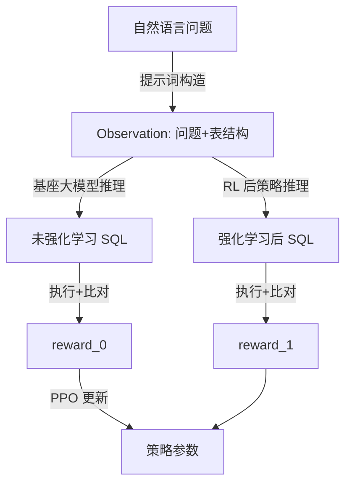

# Text-to-SQL 强化学习效果小样例（演示用）

> 通过真实评估结果中的几条样本，直观展示模型在 SQL 生成上的能力和改进空间。

---

## 代表性样本对比一览

| 类型 | 标准 SQL（gold） | 模型生成 SQL | accuracy | reward | 错误原因 |
| ---- | ---------------- | ------------ | -------- | ------ | -------- |
| 简单且完全正确 | `SELECT count(*) FROM singer` | `SELECT count(*) FROM singer` | 1.0 | 10.0 | - |
| 稍复杂但完全正确 | `SELECT name ,  country ,  age FROM singer ORDER BY age DESC` | `SELECT name, country, age FROM singer ORDER BY age DESC` | 1.0 | 10.0 | - |
| 语义接近但不完全正确 | `select max(capacity), average from stadium` | `SELECT max(capacity), avg(capacity) FROM stadium` | 0.0 | -1.0 | - |
| 触发 SQL 运行错误 | `SELECT name ,  capacity FROM stadium ORDER BY average DESC LIMIT 1` | `SELECT name, capacity FROM stadium ORDER BY avg(attendance) DESC LIMIT 1` | 0.0 | -4.0 | no such column: attendance |

---

> 上表可以直接用于 PPT 或汇报文档，按行口头解释每一类案例即可。

## Mermaid 风格概要对比（可选展示）

该图适合用来解释：同一个问题下，基模和强化后的策略都会生成 SQL，再基于执行结果的奖励来统一更新策略参数。
