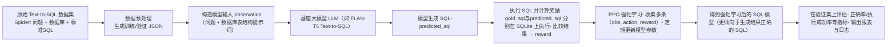

# SQL-RL-Gen 项目极简说明（给非技术领导看的版本）

> 目标：用最少的字 + 一张图，讲清楚这个项目在干什么、怎么干、为什么有价值。

---

## 1. 这个项目在做什么？

- **任务**：把自然语言问题自动翻译成正确的 SQL 查询（Text-to-SQL）。
- **场景**：非技术业务人员用中文/英文提问，系统直接查业务数据库。
- **难点**：SQL 写错一个字段/条件，就会查错数据；必须对“正确结果”极度敏感。
- **本项目的核心价值**：
- 在现有大模型的基础上，再用“执行结果是否正确”来做强化学习微调，
- 让模型不只是“看起来像”，而是“真正查对数据”的 SQL 生成器。

---

## 2. 一张图看流程（Mermaid）

可以用这张图讲清三层结构：

- **数据层**：用 Spider 这种公开数据集作为教材。
- **训练层**：用 LLM + 强化学习(PPO) 根据“执行结果好坏”来调整模型。
- **评估层**：在验证集上用同样的标准评估提升效果。

---

## 3. 项目背后的关键原理（极简版）

### 3.1 单步强化学习：一条样本 = 一次“做题”

- 每条数据样本长这样：`(问题, 数据库ID, 标准SQL)`。
- 我们把它视为一次“单步”强化学习：
- 给模型问题 + 数据库结构作为输入（状态）。
- 让模型一次性生成一条 SQL（动作）。
- 把生成的 SQL 丢到真正的数据库里执行，对比标准 SQL 的结果（奖励）。
- 这次做题就结束（没有游戏那种多步交互），属于单步 MDP。

### 3.2 奖励如何定义？

- **核心思想**：只认执行结果，不看表面长相。
- 如果生成 SQL 和金标准 SQL：
- 执行结果完全一致 → 高奖励（鼓励这种写法）。
- 语法错误 / 执行失败 / 查到完全不对的数据 → 低奖励甚至负奖励。
- 这样模型会学会“查对数据最重要”，而不是只模仿训练集的字符串。

### 3.3 PPO 在这里做了什么？

- 不断重复“做题 → 打分”，收集很多条 `(输入, 生成SQL, 奖励)` 记录。
- 每隔一段时间，用这批记录统一调整一次模型的参数。
- 调整原则很简单：
- 经常拿高分的生成方式 → 在类似问题上出现的概率被整体提高。
- 经常拿低分/报错的写法 → 概率被整体压低。
- 久而久之，同样的问题再次出现时，模型更倾向于给出真正能查对数据的 SQL。

---

## 4. 代码结构上的几个关键词（只记名字即可）

- **数据预处理**：`data_preprocess/` 目录
- **训练入口脚本**：`sql_rl_gen/generation/sql_generation.py`
- **强化学习环境 / 奖励逻辑**：`sql_rl_gen/generation/envs/sql_generation_environment.py`
- **PPO + 策略网络封装**：`sql_rl_gen/generation/rllib/`
- **评估脚本**：`sql_rl_gen/generation/evaluate_model.py`

在对外汇报时，一般不需要展开这些文件，只要知道：

- 有一套稳定的预处理脚本，保证数据干净。
- 有固定的训练脚本，用 PPO 强化学习去优化模型。
- 有评估脚本，可以用同样的执行标准来验证效果。

---

