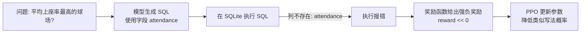

先给一个高度概括，然后一起挑“最值钱”的几个点来设计展示素材。

**建议整体结构：3–4 个“板块”+ 1 个 Demo**

1. **项目是什么 & 做了什么（1 页）**  
   - 用你刚才的 RL_EXEC_SUMMARY.md 里的那张 Mermaid 总图。  
   - 标题示例：`从自然语言到可执行 SQL：在大模型上叠加强化学习纠偏`。  
   - 目标：30 秒内让领导知道这是“在大模型基础上，用执行结果做强化学习，让 SQL 更准”。

2. **复现状况 & 技术可信度（1 页）**  
   核心是“我们不仅看了论文/代码，是实打实跑通了”：
   - 你做过的关键动作：
     - 成功跑通数据预处理（Spider → 训练/验证 JSON）。
     - 成功跑通 RL 训练脚本（PPO + 自定义环境）。
     - 成功跑通评估脚本，得到指标 CSV 和日志。
   - 可以放一张非常简单的“命令+结果”截图：
     - 例如 `sql_generation.py` 训练日志的一小段（steps / reward 稳定下来）。
     - `evaluate_model.py` 输出目录的截图：`evaluation_metrics.csv`、`statistics_metrics/` 等。  
   - 重点话术：  
     - “这套 RL pipeline 已经在我们机器上完整跑通，并生成了可对比的评估指标。”

3. **效果展示：用少量、典型例子讲“有用”而不是讲细节（2 页左右）**

   这里建议准备两类素材：

   **(A) 定量效果（1 页）**  
   - 选一两个“领导能理解”的指标：  
     - 比如：`执行结果正确率`、`SQL 执行成功率`。  
   - 展示方式：
     - 简单对比条形图：  
       - `基座大模型（未强化学习）` vs `RL 后模型`。  
       - 哪怕是 smoke 级实验，也可以展示一个“趋势对比”（说明：目前是小规模试验数据）。  
   - 话术示例：  
     - “在同一批问题上，强化学习后的模型在结果正确率上有明显提升（从 X% 到 Y%），说明‘拿执行结果当奖励’这条路是有效的。”

   **(B) 定性案例（1 页）**  
   - 挑 2–3 个最有代表性的问句 + SQL，对比：  
     - 问题文：自然语言问题（简短易懂）。  
     - 基座大模型 SQL：指出哪里“查错了”或“漏条件”。  
     - RL 后模型 SQL：说明现在能“查对业务需要的数据”。  
   - 展示方式：
     - 表格三列：`问题` / `未RL SQL（简写）` / `RL 后 SQL（简写）`。  
     - 不要贴全长 SQL，截取关键条件，对领导解释“这里多加了这个条件，所以结果对了”。  
   - 话术示例：  
     - “同样是‘2010 年之后开过演唱会的歌手’，未 RL 时漏了时间过滤；RL 之后，模型学会了正确使用时间条件。”

4. **原理简述：为什么这条路有前景（1 页）**  
   - 用你“极简说明文档”里的 3 个点即可：
     - 单步 RL：一条样本 = 一次做题（生成 SQL → 执行 → 打分）。  
     - 奖励只认执行结果：真正关注“查对数据”。  
     - PPO：不断用“做题历史”调整参数，让高分写法更常出现。  
   - 可以复用 Mermaid 图中的一部分或简化版，把 focus 放在“生成 SQL → 执行 → reward → 更新参数”这一圈上。

5. **一个简单 Demo（可选但加分）**

   如果时间允许，你可以准备一个非常短的小 Demo（甚至录屏）：

   - 形式：  
     - 一个本地或 Notebook 界面：  
       - 上面是输入自然语言问题；  
       - 中部显示模型生成 SQL；  
       - 下方显示执行结果（比如一小段表格）。  
   - 内容：  
     - 先用“未 RL 模型”跑一条问题（展示可能出错的情况）。  
     - 再用“RL 后模型”跑同一条问题（展示结果修正）。  
   - 如果真机演示不稳定，可以用截图/录屏代替，重点是“让领导看到：输入一句话 → 输出一条 SQL → 查出正确数据”。

---

**结合这些，建议你优先准备的“最关键素材清单”**

按优先级排序（从必须到可选）：

1. **Mermaid 总流程图**（已在 RL_EXEC_SUMMARY.md 里）  
   - 用于讲“我们在做什么”和“整体结构专业、可扩展”。

2. **一页指标对比图**  
   - 至少包含：`执行结果正确率`，有无 RL 模型之间的对比。  
   - 即便只是 smoke 实验，也可以先标注为“试验规模”，重点说趋势。

3. **两三个典型问句的“前后对比案例”**  
   - 这是最容易打动人的：让领导看到具体业务问题和查询结果的变化。

4. **简短原理图 + 三句原理解释**  
   - 单步 RL、执行结果做奖励、PPO 调参，这三点用非常浅显的语言说一遍。

5. **可选 Demo/录屏**  
   - 如果你有时间做前端/Notebook 展示，这会让整个汇报非常直观。

---

如果你愿意，下一步我可以具体帮你：

- 从你现有的评估输出里挑几条“好讲故事”的样本（问题 + SQL 对比）并整理成一页表格草稿；  
- 或者根据当前 output 目录结构，设计一页图表（正确率对比）的具体数据和图形说明文案，方便你直接做成 PPT。


---
先给 PPT 大纲，然后补一个你可以直接用的 Markdown 表格/mermaid 对比模块示例，方便粘进汇报稿里。

**PPT 大纲（建议 5 页）**

**第 1 页：项目概览——在大模型上叠加强化学习纠偏**

- 目标：从自然语言问题自动生成“真正能查对数据”的 SQL。  
- 背景：大模型能写 SQL，但容易“看起来对、执行结果错”。  
- 本项目做的事：在开源 Text-to-SQL 基座模型上，引入执行结果驱动的 PPO 强化学习。  
- 收益：让模型更关注“查对数据”而不是“像人写的样子”。

**第 2 页：整体流程——一张图讲清工作流**

- 用 RL_EXEC_SUMMARY.md 里的 Mermaid 总图（数据 → 预处理 → LLM 生成 SQL → 执行 + 奖励 → PPO 训练 → 评估）。  
- 重点点三层：
  - 数据层：Spider 等公开数据集 + SQLite 数据库。  
  - 训练层：LLM + 自定义 SQL 环境 + PPO。  
  - 评估层：在 dev 集上按执行结果算指标，输出报表。  
- 强调：你已经把整条 pipeline 在本机环境完整跑通。

**第 3 页：核心原理——“做题打分”的单步强化学习**

- 单条样本 = 一次做题：  
  - 输入：问题 + 数据库结构（状态）。  
  - 输出：一条 SQL（动作）。  
  - 执行 SQL，对比标准结果（奖励）。  
- 奖励设计：  
  - 结果完全一致 → 高奖励；  
  - 执行报错/查错数据 → 强负奖励。  
- PPO 作用：  
  - 收集大量 “(输入, SQL, 奖励)” 样本；  
  - 周期性更新参数，让高分写法更常出现，低分写法被抑制。  
- 可用一张简单 Mermaid 子图画出：`状态 → 动作 → 执行 → 奖励 → 参数更新`。

**第 4 页：效果案例对比——用表格讲 3–4 条最典型样本**

- 使用 Markdown 表格或 Mermaid 表格式展示（示例见下）。  
- 推荐结构：  
  - 行 1：简单计数题（完全正确）。  
  - 行 2：排序/多列题（完全正确）。  
  - 行 3：语义接近但不完全正确（reward 轻微负）。  
  - 行 4：使用错误字段导致 SQL 报错（reward 强负）。  
- 每行列：  
  - 问题（简短中文描述）；  
  - 标准 SQL（gold，简化展示）；  
  - 模型生成 SQL（简化展示）；  
  - 执行结果 & reward（正确/错误/报错）。  
- 口头重点：  
  - “简单和中等复杂问题，模型已经很稳”；  
  - “复杂定义/字段上还有‘差一点’的错误，强化学习正在帮它纠偏”；  
  - “明显错误会被执行层抓出来并强烈惩罚”。

**第 5 页：落地价值 & 下一步计划**

- 落地价值：
  - 可以迁移到内部业务数据库（换数据 + 换 schema + 调整 reward）；
  - 适合作为“业务问数”的中台能力：业务用自然语言，底层查 SQL。  
- 你已经做到的：
  - 环境搭建、数据预处理、训练、评估全流程复现；
  - 整理了关键文档与演示脚本（自动生成对比样本）。  
- 下一步（可以说成“建议方向”）：
  - 用小规模内部表（脱敏后）做一次 PoC；  
  - 丰富奖励设计（例如列覆盖率、业务约束）；  
  - 持续迭代 Prompt + 模型选择。

---

**Markdown 表格/mermaid 对比示例（可直接复用）**

你可以把从 RL_DEMO_SHOWCASE.md 里抽出的几条案例，用表格化方式展示，例如：

```markdown
| 案例 | 自然语言问题（示意） | 标准 SQL（gold，简写） | 模型生成 SQL（简写） | 执行结果 & 奖励 |
|------|----------------------|------------------------|----------------------|------------------|
| 1 简单计数 | 有多少歌手记录在系统中？ | `SELECT count(*) FROM singer` | `SELECT count(*) FROM singer` | 结果完全一致；`accuracy=1.0, reward=10.0` |
| 2 排序多列 | 列出歌手姓名、国家、年龄，按年龄从大到小排序 | `SELECT name, country, age FROM singer ORDER BY age DESC` | `SELECT name, country, age FROM singer ORDER BY age DESC` | 结果完全一致；`accuracy=1.0, reward=10.0` |
| 3 语义接近 | 查询每个球场最大容量和预定义平均值指标 | `SELECT max(capacity), average FROM stadium` | `SELECT max(capacity), avg(capacity) FROM stadium` | 方向对，但字段含义不符；`accuracy=0.0, reward≈-1` |
| 4 字段错误 | 找出平均上座率最高的球场及其容量 | `SELECT name, capacity FROM stadium ORDER BY average DESC LIMIT 1` | `SELECT name, capacity FROM stadium ORDER BY avg(attendance) DESC LIMIT 1` | 列 `attendance` 不存在 → SQL 报错；`reward≈-4` |
```

如果你想用 Mermaid 来强调“错误惩罚”的流程，可以加一小段（配合第 3 或第 4 页）：



这两段可以直接嵌进你的汇报 Markdown 或用作 PPT 的讲稿参考。

如果你希望，我可以按这个大纲进一步帮你写出“每页 PPT 的逐字讲稿”（每页 3–4 句话），让你到时候基本照着说就行。